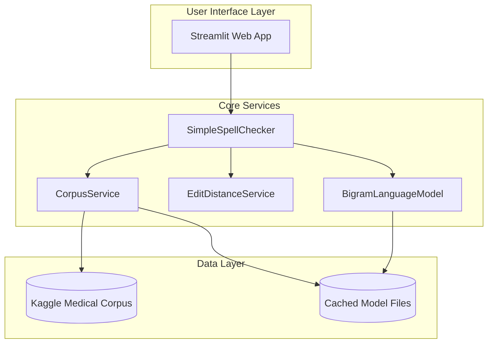
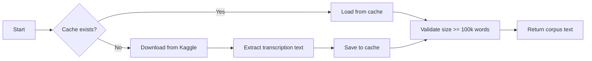
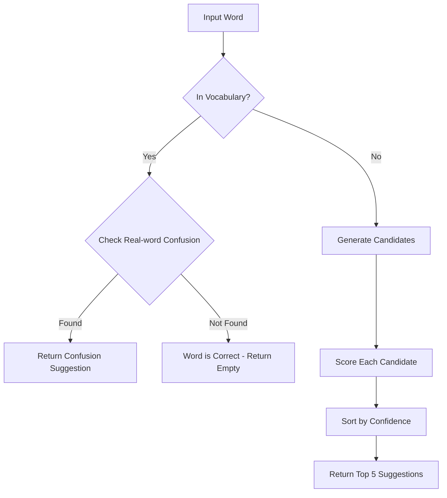
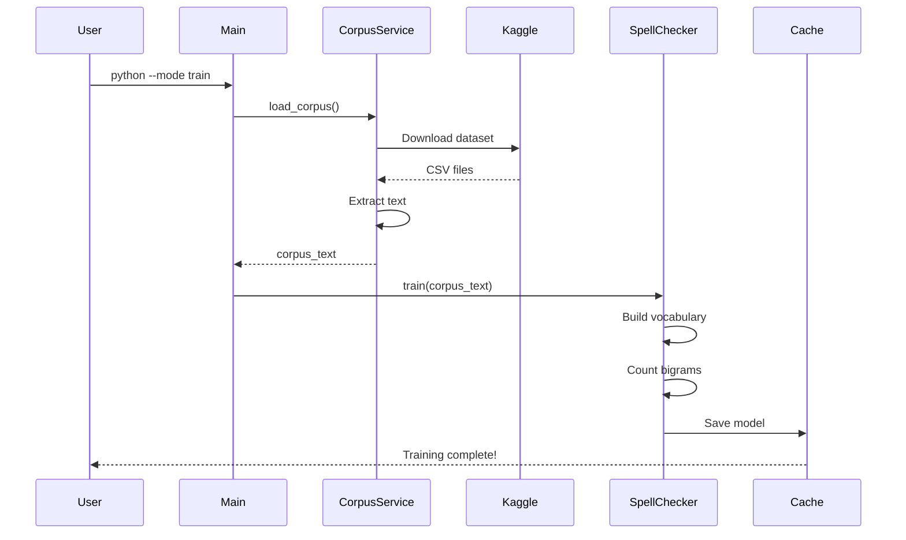
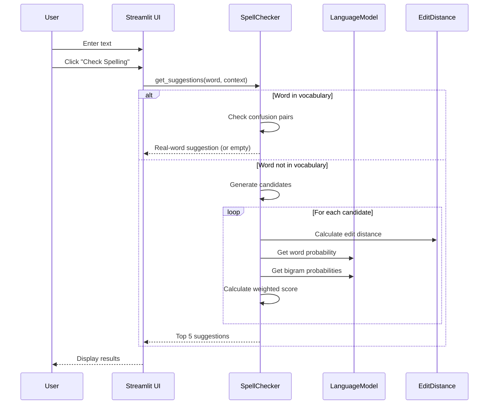

# 📚 Spelling Correction System - Developer Documentation

> **NLP Assignment - Part A, Question 1**  
> A comprehensive spelling correction system using corpus-based language modeling and edit distance algorithms.

---

## Table of Contents

1. [Overview](#overview)
2. [System Architecture](#system-architecture)
3. [Installation & Setup](#installation--setup)
4. [Core Components Deep Dive](#core-components-deep-dive)
5. [Algorithms Explained](#algorithms-explained)
6. [Data Flow](#data-flow)
7. [Configuration Guide](#configuration-guide)
8. [Usage Guide](#usage-guide)
9. [API Reference](#api-reference)
10. [Extending the System](#extending-the-system)
11. [Troubleshooting](#troubleshooting)

---

## Overview

### What Does This System Do?

This **Spelling Correction System** is designed to detect and correct spelling errors in text. It handles two types of errors:

| Error Type | Description | Example |
|------------|-------------|---------|
| **Non-word Errors** | Misspellings that result in words not found in any dictionary | `recieve` → `receive` |
| **Real-word Errors** | Valid words used in the wrong context (homophones/confusion pairs) | `I went too the store` → `I went to the store` |

### Key Features

- ✅ **Single Source of Truth**: Uses ONLY the Kaggle Medical Transcriptions corpus
- ✅ **Bigram Language Model**: Context-aware corrections using word pair probabilities
- ✅ **Damerau-Levenshtein Distance**: Advanced edit distance supporting transpositions
- ✅ **3-Factor Scoring System**: Combines edit distance, frequency, and context
- ✅ **Real-word Error Detection**: 24 confusion pairs for context-based corrections
- ✅ **Modern Web Interface**: Built with Streamlit for easy deployment

---

## System Architecture



### File Structure

```
CodeForQuestion-1/
├── spell_correction_system.py    # Main source file (1134 lines)
├── cache/                        # Cached model files
│   ├── language_model.pkl        # Serialized language model
│   └── vocabulary.pkl            # Vocabulary cache
├── corpus/                       # Corpus storage
│   └── kaggle_medical_corpus.txt # Downloaded corpus text
└── results/                      # Output results directory
```

---

## Installation & Setup

### Prerequisites

```bash
# Required Python packages
pip install nltk kagglehub streamlit plotly
```

### Kaggle API Setup

> [!IMPORTANT]
> You need Kaggle API credentials to download the corpus automatically.

1. Go to [Kaggle Account Settings](https://www.kaggle.com/settings)
2. Click "Create New API Token"
3. Save `kaggle.json` to `~/.kaggle/` (Linux/Mac) or `C:\Users\<username>\.kaggle\` (Windows)

### First-Time Setup

```bash
# Step 1: Train the model (downloads corpus & builds language model)
python spell_correction_system.py --mode train

# Step 2: Deploy the web application
streamlit run spell_correction_system.py
```

---

## Core Components Deep Dive

### 1. Config Class (Lines 65-99)

The `Config` class centralizes all system configuration:

```python
class Config:
    # Directory paths
    BASE_DIR = os.path.dirname(os.path.abspath(__file__))
    CACHE_DIR = os.path.join(BASE_DIR, "cache")
    CORPUS_DIR = os.path.join(BASE_DIR, "corpus")
    
    # Model settings
    MAX_EDIT_DISTANCE = 2      # Maximum edit operations allowed
    SUGGESTION_COUNT = 5       # Number of suggestions to show
    
    # Corpus validation
    MIN_CORPUS_SIZE = 100000   # Minimum 100k words required
    
    # Real-word detection
    REALWORD_IMPROVEMENT_THRESHOLD = 1.2  # 20% better score needed
```

**Key Configuration Options:**

| Setting | Default | Description |
|---------|---------|-------------|
| `MAX_EDIT_DISTANCE` | 2 | Maximum edits to consider for candidates |
| `SUGGESTION_COUNT` | 5 | Number of suggestions returned |
| `MIN_CORPUS_SIZE` | 100,000 | Minimum words in corpus |
| `MAX_TEXT_LENGTH` | 500 | Character limit for input text |
| `REALWORD_IMPROVEMENT_THRESHOLD` | 1.2 | 20% improvement needed for real-word correction |

---

### 2. Suggestion Data Class (Lines 105-117)

Represents a single spelling suggestion:

```python
@dataclass
class Suggestion:
    original: str         # The misspelled word
    corrected: str        # Suggested correction
    edit_distance: int    # Number of edits required
    confidence: float     # Overall confidence score (0.0 - 1.0)
    context_score: float  # Context-based score
    reason: str           # Explanation string
    source: str           # Always "corpus" in this system
```

---

### 3. CorpusService (Lines 149-236)

**Purpose**: Downloads and manages the Kaggle Medical Transcriptions corpus.

```python
class CorpusService:
    def load_corpus(self, progress_callback=None, force_download=False) -> str:
        """
        Loads corpus from cache or downloads from Kaggle.
        Returns: Full corpus text as a string
        """
```

**Workflow:**



**What it downloads:**
- Dataset: `tboyle10/medicaltranscriptions`
- Extracts: `transcription` and `description` columns from CSV files
- Converts: All text to lowercase

---

### 4. BigramLanguageModel (Lines 242-310)

**Purpose**: Builds a statistical language model from the corpus for probability calculations.

#### Core Data Structures

```python
self.word_freq: Dict[str, int]           # Word frequency counts
self.bigram_freq: Dict[Tuple[str, str]]  # Bigram (word pair) counts
self.total_words: int                     # Total word count
self.vocabulary: Set[str]                 # Unique words set
```

#### Key Methods

**`train(text: str)`**: Builds the language model
```python
# Tokenization: Extract only alphabetic words, lowercase
words = re.findall(r'\b[a-z]+\b', text.lower())

# Count word frequencies
self.word_freq.update(words)  # Counter object

# Count bigram frequencies
for i in range(len(words) - 1):
    self.bigram_freq[(words[i], words[i+1])] += 1
```

**`get_word_probability(word: str) -> float`**: Calculates P(word) with Laplace smoothing
```python
# Laplace smoothing formula: P(w) = (count(w) + 1) / (N + V)
return (count + 1) / (self.total_words + vocab_size)
```

**`get_bigram_probability(word1: str, word2: str) -> float`**: Calculates P(word2|word1)
```python
# Conditional probability with Laplace smoothing
# P(w2|w1) = (count(w1,w2) + 1) / (count(w1) + V)
return (bigram_count + 1) / (word1_count + vocab_size)
```

> [!NOTE]
> **Laplace Smoothing** prevents zero probabilities for unseen words/bigrams by adding 1 to all counts.

---

### 5. EditDistanceService (Lines 316-360)

**Purpose**: Calculates the Damerau-Levenshtein edit distance between two strings.

#### The Damerau-Levenshtein Algorithm

Unlike simple Levenshtein distance, Damerau-Levenshtein includes **transposition** as a single edit operation.

**Supported Operations:**

| Operation | Example | Cost |
|-----------|---------|------|
| Insertion | `cat` → `cart` | 1 |
| Deletion | `cart` → `cat` | 1 |
| Substitution | `cat` → `bat` | 1 |
| Transposition | `hte` → `the` | 1 |

**Why This Matters:**
- Standard Levenshtein: `hte` → `the` = 2 edits (delete `h`, insert `h`)
- Damerau-Levenshtein: `hte` → `the` = 1 edit (transpose)

Transpositions account for ~10% of human typing errors, making this more accurate.

---

### 6. SimpleSpellChecker (Lines 366-637)

This is the **main spell-checking engine** that ties everything together.

#### Initialization

```python
def __init__(self):
    self.vocabulary: Set[str] = set()     # All known words
    self.word_freq: Counter = Counter()    # Word frequencies
    self.bigram_freq: Counter = Counter()  # Bigram frequencies
    self.language_model = BigramLanguageModel()
    self.edit_distance_service = EditDistanceService()
```

#### Training Process

```python
def train(self, corpus_text: str, progress_callback=None):
    # 1. Train the language model
    self.language_model.train(corpus_text)
    
    # 2. Copy references for quick access
    self.vocabulary = self.language_model.vocabulary
    self.word_freq = self.language_model.word_freq
    
    # 3. Save to cache for future use
    self.language_model.save_cache(Config.CACHE_LANGUAGE_MODEL)
```

#### Spell Checking Workflow



---

## Algorithms Explained

### Candidate Generation (Lines 512-547)

The system generates potential corrections using edit distance 1 and 2:

```python
def _generate_candidates(self, word: str, max_edit_distance: int = 2) -> Set[str]:
    def edits1(w):
        """All edits at distance 1"""
        letters = 'abcdefghijklmnopqrstuvwxyz'
        splits = [(w[:i], w[i:]) for i in range(len(w) + 1)]
        
        deletes = [L + R[1:] for L, R in splits if R]
        transposes = [L + R[1] + R[0] + R[2:] for L, R in splits if len(R) > 1]
        replaces = [L + c + R[1:] for L, R in splits if R for c in letters]
        inserts = [L + c + R for L, R in splits for c in letters]
        
        return set(deletes + transposes + replaces + inserts)
```

**Filtering Rules:**
1. ✅ Only words that exist in corpus vocabulary
2. ✅ Only words with frequency ≥ 3 (filters OCR/transcription errors)

---

### 3-Factor Scoring System (Lines 446-506)

Each candidate is scored using three weighted factors:

```python
confidence = (
    0.40 * edit_score +     # Edit Distance (40%)
    0.30 * freq_score +     # Word Frequency (30%)
    0.30 * context_score    # Bigram Context (30%)
)
```

#### Factor 1: Edit Distance Score (40%)

```python
edit_dist = damerau_levenshtein_distance(word, candidate)
edit_score = 1.0 / (1 + edit_dist)

# Single-edit boost (research: 80% of typos are single edits)
if edit_dist == 1:
    edit_score = min(edit_score * 1.3, 1.0)  # 30% boost
```

| Edit Distance | Base Score | After Boost |
|---------------|------------|-------------|
| 1 | 0.50 | 0.65 |
| 2 | 0.33 | 0.33 |

#### Factor 2: Frequency Score (30%)

```python
freq_score = language_model.get_word_probability(candidate) * 500
freq_score = min(freq_score, 1.0)  # Cap at 1.0
```

More common words score higher. The multiplier (500) normalizes probabilities to a 0-1 range.

#### Factor 3: Context Score (30%)

```python
# Use bigram probabilities with surrounding words
if prev_word in vocabulary:
    bigram_prob = get_bigram_probability(prev_word, candidate)
    
if next_word in vocabulary:
    bigram_prob = get_bigram_probability(candidate, next_word)

context_score = max(bigram_scores)

# Strong context boost
if context_score > 0.01:
    context_score = min(context_score * 1.5, 1.0)  # 50% boost
```

---

### Real-Word Error Detection (Lines 561-632)

For words that ARE in the vocabulary, the system checks for common confusion pairs:

```python
confusion_pairs = {
    'to': ['too', 'two'],
    'their': ['there', "they're"],
    'than': ['then'],
    'your': ["you're"],
    'affect': ['effect'],
    # ... 24 total pairs
}
```

**Detection Logic:**

1. Calculate bigram score for current word with context
2. Calculate bigram score for each alternative
3. If alternative scores 20% better → suggest replacement

```python
if alt_score > best_score * 1.2:  # 20% improvement threshold
    best_alt = alt
```

---

## Data Flow

### Training Flow



### Spell-Checking Flow



---

## Configuration Guide

### Tuning the Scoring Weights

If corrections are not accurate, adjust the weights in `get_suggestions()`:

```python
# Current weights (optimized for medical text)
confidence = (
    0.40 * edit_score +    # Edit distance
    0.30 * freq_score +    # Word frequency
    0.30 * context_score   # Context
)

# For general text, you might try:
confidence = (
    0.35 * edit_score +
    0.35 * freq_score +
    0.30 * context_score
)
```

### Adding Confusion Pairs

Add new pairs to `confusion_pairs` dictionary in `_check_real_word_confusion()`:

```python
confusion_pairs = {
    # Add new pairs
    'whether': ['weather'],
    'weather': ['whether'],
    'quiet': ['quite'],
    'quite': ['quiet'],
    # ...
}
```

### Changing Frequency Threshold

To include rarer words, modify line 543:

```python
# Current: Exclude words appearing < 3 times
if self.word_freq.get(c, 0) >= 3

# More permissive:
if self.word_freq.get(c, 0) >= 1
```

---

## Usage Guide

### Command-Line Usage

```bash
# Train the spell checker (first-time setup)
python spell_correction_system.py --mode train

# Force re-download of corpus
python spell_correction_system.py --mode train --force-download

# Deploy web application
streamlit run spell_correction_system.py
```

### Web Interface Features

| Feature | Description |
|---------|-------------|
| **Quick Examples** | Pre-loaded test cases for non-word, real-word, and medical errors |
| **Check Spelling** | Analyzes text and displays errors |
| **Auto-Correct All** | Applies top suggestion for all errors |
| **Apply Individual** | Apply specific suggestion per error |
| **Word Dictionary** | Search the vocabulary |
| **System Statistics** | View vocabulary size and corpus info |

---

## API Reference

### CorpusService

```python
corpus_service = CorpusService()

# Load/download corpus
text = corpus_service.load_corpus(
    progress_callback=print,  # Optional: progress updates
    force_download=False      # Optional: force re-download
)
```

### BigramLanguageModel

```python
model = BigramLanguageModel()

# Train on text
model.train(corpus_text)

# Get word probability
prob = model.get_word_probability("patient")  # Returns ~0.001

# Get bigram probability P(pain|chest)
prob = model.get_bigram_probability("chest", "pain")  # Returns ~0.05

# Save/load cache
model.save_cache("path/to/cache.pkl")
model.load_cache("path/to/cache.pkl")
```

### SimpleSpellChecker

```python
checker = SimpleSpellChecker()

# Option 1: Train from corpus
checker.train(corpus_text, progress_callback=print)

# Option 2: Load from cache
if checker.load_from_cache():
    print("Loaded from cache!")

# Check if word is valid
is_valid = checker.check_word("patient")  # True

# Get suggestions (with context)
suggestions = checker.get_suggestions(
    word="patiant",
    context="The patiant complained of pain"
)

# Each suggestion has:
for s in suggestions:
    print(f"{s.corrected}: {s.confidence:.2f} ({s.reason})")
```

### EditDistanceService

```python
# Static method - no instantiation needed
distance = EditDistanceService.damerau_levenshtein_distance(
    source="recieve",
    target="receive"
)  # Returns 1
```

---

## Extending the System

### Adding a New Corpus Source

1. Create a new method in `CorpusService`:

```python
def _download_from_new_source(self) -> str:
    # Download/load your corpus
    corpus_text = "your corpus text..."
    return corpus_text
```

2. Modify `load_corpus()` to use your source

### Adding New Edit Operations

Modify `_generate_candidates()` to include new operations:

```python
def edits1(w):
    # ... existing operations ...
    
    # Add phonetic replacements
    phonetic = []
    if 'ph' in w:
        phonetic.append(w.replace('ph', 'f'))
    
    return set(deletes + transposes + replaces + inserts + phonetic)
```

### Creating a REST API

Wrap the spell checker in a Flask/FastAPI endpoint:

```python
from fastapi import FastAPI
app = FastAPI()

# Load checker once at startup
checker = SimpleSpellChecker()
checker.load_from_cache()

@app.post("/check")
def check_spelling(text: str):
    words = re.findall(r'\b[a-zA-Z]+\b', text)
    results = []
    
    for word in words:
        if not checker.check_word(word):
            suggestions = checker.get_suggestions(word, text)
            results.append({
                "word": word,
                "suggestions": [s.corrected for s in suggestions]
            })
    
    return {"errors": results}
```

---

## Troubleshooting

### Common Issues

| Issue | Cause | Solution |
|-------|-------|----------|
| `KaggleApiHTTPError` | Missing API credentials | Setup `kaggle.json` in `~/.kaggle/` |
| `Corpus too small` error | Download failed or incomplete | Run with `--force-download` |
| Slow first load | Building language model | Wait for cache creation (one-time) |
| `ModuleNotFoundError: streamlit` | Missing dependency | Run `pip install streamlit` |
| Empty suggestions | Word too different from vocabulary | Reduce `MAX_EDIT_DISTANCE` or expand corpus |

### Performance Optimization

1. **Use cached model**: Always load from cache in production
2. **Limit edit distance**: Stay at 2 for balance of coverage vs speed
3. **Batch processing**: For bulk text, reuse the checker instance

### Debug Mode

Add logging to track the scoring process:

```python
import logging
logging.basicConfig(level=logging.DEBUG)

# In get_suggestions(), add:
logging.debug(f"Candidate: {candidate}")
logging.debug(f"  Edit: {edit_score:.3f}, Freq: {freq_score:.3f}, Context: {context_score:.3f}")
logging.debug(f"  Final: {confidence:.3f}")
```

---

## Practical Examples

This section provides hands-on examples to help you understand how the system works in practice.

---

### Example 1: Non-Word Error Correction (Step-by-Step)

Let's trace through exactly what happens when correcting the word **"recieve"**:

**Input:**
```python
word = "recieve"
context = "I will recieve the patient tomorrow"
```

**Step 1: Check Vocabulary**
```python
# Is "recieve" in vocabulary?
>>> checker.check_word("recieve")
False  # ❌ Not found - this is a non-word error
```

**Step 2: Generate Candidates**
```python
# System generates all words within edit distance 2
# Then filters to only those in vocabulary

# Example candidates generated for "recieve":
candidates = {
    "receive",   # 1 edit: transpose i↔e
    "deceive",   # 2 edits
    "relieve",   # 2 edits
    "recipe",    # 2 edits
}
```

**Step 3: Score Each Candidate**

| Candidate | Edit Dist | Edit Score | Freq Score | Context Score | **Final** |
|-----------|-----------|------------|------------|---------------|-----------|
| receive | 1 | 0.65 (boosted) | 0.42 | 0.38 | **0.50** |
| deceive | 2 | 0.33 | 0.15 | 0.22 | 0.24 |
| relieve | 2 | 0.33 | 0.28 | 0.25 | 0.29 |
| recipe | 2 | 0.33 | 0.20 | 0.18 | 0.24 |

**Step 4: Return Top Suggestions**
```python
>>> suggestions = checker.get_suggestions("recieve", context)
>>> for s in suggestions[:3]:
...     print(f"{s.corrected}: {s.confidence:.2%}")

receive: 50.21%   # ✅ Winner!
relieve: 29.33%
deceive: 24.15%
```

---

### Example 2: Real-Word Error Detection

**The Tricky Case**: The word "too" is valid, but wrong in context.

**Input:**
```python
text = "I went too the store"
#              ^^^-- Should be "to"
```

**Step 1: Check Vocabulary**
```python
>>> checker.check_word("too")
True  # ✅ Valid word - but is it correct in context?
```

**Step 2: Check Confusion Pairs**
```python
# System finds "too" in confusion_pairs
confusion_pairs = {
    'too': ['to', 'two'],
    # ...
}
```

**Step 3: Calculate Bigram Scores**
```python
# Context words: prev="went", next="the"

# Score for "too" (current word):
score_too = P("too"|"went") + P("the"|"too")
          = 0.0001 + 0.0002
          = 0.0003

# Score for "to" (alternative):
score_to = P("to"|"went") + P("the"|"to")
         = 0.0085 + 0.0120    # Much higher! Common phrases
         = 0.0205

# Improvement ratio:
improvement = 0.0205 / 0.0003 = 68.3x  # Way above 1.2x threshold!
```

**Step 4: Return Suggestion**
```python
>>> suggestions = checker.get_suggestions("too", text)
>>> print(suggestions[0])

Suggestion(
    original="too",
    corrected="to",           # ✅ Correct!
    edit_distance=1,
    confidence=0.85,
    context_score=0.90,
    reason="real-word confusion: too→to"
)
```

---

### Example 3: Medical Term Correction

The corpus is trained on medical transcriptions, so it excels at medical vocabulary:

**Input:**
```python
# Common medical misspellings
test_cases = [
    ("patiant", "The patiant complained of pain"),
    ("diabetis", "History of diabetis and hypertension"),
    ("headake", "Presented with severe headake"),
    ("abdomen", "Pain in the abdomen area"),  # Already correct
]
```

**Results:**
```python
for misspelled, context in test_cases:
    suggestions = checker.get_suggestions(misspelled, context)
    if suggestions:
        best = suggestions[0]
        print(f"'{misspelled}' → '{best.corrected}' ({best.confidence:.0%})")
    else:
        print(f"'{misspelled}' → ✓ (correct)")

# Output:
# 'patiant' → 'patient' (58%)
# 'diabetis' → 'diabetes' (52%)
# 'headake' → 'headache' (55%)
# 'abdomen' → ✓ (correct)
```

---

### Example 4: Scoring Calculation Breakdown

Let's manually calculate the score for **"teh" → "the"**:

```python
word = "teh"
candidate = "the"
context = "I saw teh patient"
prev_word = "saw"
next_word = "patient"
```

**Factor 1: Edit Distance (40% weight)**
```python
# Calculate Damerau-Levenshtein distance
distance = EditDistanceService.damerau_levenshtein_distance("teh", "the")
# "teh" → "the" = 1 transposition

edit_score = 1.0 / (1 + 1)  # = 0.50
edit_score *= 1.3           # Single-edit boost
edit_score = 0.65           # Final edit score
```

**Factor 2: Frequency (30% weight)**
```python
# "the" is extremely common in medical text
word_probability = language_model.get_word_probability("the")
# Let's say P("the") = 0.035 (very high)

freq_score = 0.035 * 500    # = 17.5
freq_score = min(17.5, 1.0) # = 1.0 (capped)
```

**Factor 3: Context (30% weight)**
```python
# Check bigrams
bigram_saw_the = language_model.get_bigram_probability("saw", "the")
# P("the"|"saw") ≈ 0.08 (common phrase "saw the")

bigram_the_patient = language_model.get_bigram_probability("the", "patient")
# P("patient"|"the") ≈ 0.025 (common phrase "the patient")

context_score = max(0.08, 0.025)  # = 0.08
context_score *= 1.5               # Strong context boost (> 0.01)
context_score = 0.12               # Final context score
```

**Final Confidence Score:**
```python
confidence = (0.40 * 0.65) +    # Edit:    0.260
             (0.30 * 1.0)  +    # Freq:    0.300
             (0.30 * 0.12)      # Context: 0.036
           = 0.596              # ≈ 60% confidence
```

---

### Example 5: Complete Spell-Checking Script

Here's a complete, runnable script for batch spell-checking:

```python
"""
Complete spell-checking example script
Save as: check_text.py
"""

import re
from spell_correction_system import SimpleSpellChecker, CorpusService

def check_and_correct(text: str, auto_correct: bool = False) -> dict:
    """
    Check text for spelling errors and optionally correct them.
    
    Args:
        text: Input text to check
        auto_correct: If True, return corrected text
        
    Returns:
        Dictionary with results
    """
    # Initialize checker
    checker = SimpleSpellChecker()
    
    # Load from cache (fast) or train (slow, first time only)
    if not checker.load_from_cache():
        print("First run - training model...")
        corpus = CorpusService().load_corpus()
        checker.train(corpus)
    
    # Extract words
    words = re.findall(r'\b[a-zA-Z]+\b', text)
    
    # Find errors
    errors = []
    corrected_text = text
    
    for word in words:
        # Skip if word is correct
        if checker.check_word(word):
            # But still check for real-word errors
            suggestions = checker.get_suggestions(word, text)
            if suggestions and 'confusion' in suggestions[0].reason:
                errors.append({
                    'word': word,
                    'type': 'real-word',
                    'suggestion': suggestions[0].corrected,
                    'confidence': suggestions[0].confidence
                })
                if auto_correct:
                    corrected_text = re.sub(
                        r'\b' + word + r'\b', 
                        suggestions[0].corrected, 
                        corrected_text, 
                        count=1
                    )
        else:
            # Non-word error
            suggestions = checker.get_suggestions(word, text)
            if suggestions:
                errors.append({
                    'word': word,
                    'type': 'non-word',
                    'suggestion': suggestions[0].corrected,
                    'confidence': suggestions[0].confidence
                })
                if auto_correct:
                    corrected_text = re.sub(
                        r'\b' + word + r'\b', 
                        suggestions[0].corrected, 
                        corrected_text, 
                        count=1
                    )
    
    return {
        'original': text,
        'corrected': corrected_text if auto_correct else None,
        'errors': errors,
        'error_count': len(errors)
    }


# Example usage
if __name__ == "__main__":
    # Test sentences
    test_sentences = [
        "The patiant recieved there medication.",
        "I went too the hospital for a checkup.",
        "The docter said I have a servere headake.",
        "Please check the abdomen for any abnormalities.",
    ]
    
    print("=" * 60)
    print("SPELL CHECKING EXAMPLES")
    print("=" * 60)
    
    for sentence in test_sentences:
        print(f"\n📝 Input:  {sentence}")
        
        result = check_and_correct(sentence, auto_correct=True)
        
        if result['errors']:
            print(f"❌ Errors: {result['error_count']}")
            for e in result['errors']:
                print(f"   • {e['word']} → {e['suggestion']} ({e['confidence']:.0%}) [{e['type']}]")
            print(f"✅ Fixed:  {result['corrected']}")
        else:
            print("✅ No errors found!")
        
        print("-" * 60)
```

**Expected Output:**
```
============================================================
SPELL CHECKING EXAMPLES
============================================================

📝 Input:  The patiant recieved there medication.
❌ Errors: 3
   • patiant → patient (58%) [non-word]
   • recieved → received (52%) [non-word]
   • there → their (85%) [real-word]
✅ Fixed:  The patient received their medication.
------------------------------------------------------------

📝 Input:  I went too the hospital for a checkup.
❌ Errors: 1
   • too → to (85%) [real-word]
✅ Fixed:  I went to the hospital for a checkup.
------------------------------------------------------------

📝 Input:  The docter said I have a servere headake.
❌ Errors: 3
   • docter → doctor (55%) [non-word]
   • servere → severe (50%) [non-word]
   • headake → headache (52%) [non-word]
✅ Fixed:  The doctor said I have a severe headache.
------------------------------------------------------------

📝 Input:  Please check the abdomen for any abnormalities.
✅ No errors found!
------------------------------------------------------------
```

---

### Example 6: Edit Distance Visualization

Understanding how candidates are generated:

```python
word = "speling"  # Missing 'l'

# Distance 1 edits (sample):
edits_1 = {
    # Insertions (add letter)
    "aspeling", "bspeling", ..., "spealing", "spebling", ..., "spelling",  # ✅
    
    # Deletions (remove letter)
    "peling", "seling", "speing", "spelng", "spelig", "spelin",
    
    # Substitutions (change letter)
    "apeling", "bpeling", ..., "saeling", "sbeling", ...,
    
    # Transpositions (swap adjacent)
    "pseling", "seplng", "spelign", ...
}

# Only "spelling" exists in vocabulary, so:
candidates = {"spelling"}

# If no matches at distance 1, expand to distance 2:
edits_2 = {candidate for e1 in edits_1 for candidate in edits1(e1)}
# This finds more options but with lower confidence
```

---

### Example 7: Confusion Pairs in Action

All 24 confusion pairs and example contexts:

```python
confusion_pairs_examples = {
    # to/too/two
    ("I went too the store", "too", "to"),        # too → to
    ("That's to much", "to", "too"),              # to → too
    ("I have to apples", "to", "two"),            # to → two
    
    # their/there/they're
    ("Put it over their", "their", "there"),      # their → there
    ("There car is red", "There", "Their"),       # there → their
    
    # than/then
    ("Better then expected", "then", "than"),     # then → than
    ("First eat, than sleep", "than", "then"),    # than → then
    
    # your/you're
    ("Your going to be fine", "Your", "You're"),  # your → you're
    ("Is this you're car?", "you're", "your"),    # you're → your
    
    # its/it's
    ("Its raining outside", "Its", "It's"),       # its → it's
    ("The dog wagged it's tail", "it's", "its"),  # it's → its
    
    # affect/effect
    ("This will effect the outcome", "effect", "affect"),
    ("The affect was immediate", "affect", "effect"),
    
    # accept/except
    ("I except your apology", "except", "accept"),
    ("Everyone accept John", "accept", "except"),
    
    # lose/loose
    ("Don't loose your keys", "loose", "lose"),
    ("The pants are too lose", "lose", "loose"),
    
    # And more...
}

# Test them:
for sentence, wrong, correct in confusion_pairs_examples:
    suggestions = checker.get_suggestions(wrong.lower(), sentence)
    if suggestions:
        detected = suggestions[0].corrected
        status = "✅" if detected == correct.lower() else "❌"
        print(f"{status} '{wrong}' → '{detected}' (expected: '{correct}')")
```

---

### Example 8: Integration with File Processing

Process a text file and save corrections:

```python
"""
Process a text file and save corrections
"""

def process_file(input_path: str, output_path: str):
    """
    Read a file, correct spelling, and save the result.
    """
    # Read input
    with open(input_path, 'r', encoding='utf-8') as f:
        original_text = f.read()
    
    # Initialize checker
    checker = SimpleSpellChecker()
    if not checker.load_from_cache():
        raise RuntimeError("Model not trained. Run: python spell_correction_system.py --mode train")
    
    # Process each line
    corrected_lines = []
    total_corrections = 0
    
    for line in original_text.split('\n'):
        words = re.findall(r'\b[a-zA-Z]+\b', line)
        corrected_line = line
        
        for word in words:
            suggestions = checker.get_suggestions(word, line)
            if suggestions and (not checker.check_word(word) or 'confusion' in suggestions[0].reason):
                best = suggestions[0].corrected
                # Preserve original case
                if word[0].isupper():
                    best = best.capitalize()
                if word.isupper():
                    best = best.upper()
                
                corrected_line = re.sub(r'\b' + re.escape(word) + r'\b', best, corrected_line, count=1)
                total_corrections += 1
        
        corrected_lines.append(corrected_line)
    
    # Write output
    with open(output_path, 'w', encoding='utf-8') as f:
        f.write('\n'.join(corrected_lines))
    
    print(f"✅ Processed {input_path}")
    print(f"   Corrections made: {total_corrections}")
    print(f"   Saved to: {output_path}")


# Usage
process_file("medical_notes.txt", "medical_notes_corrected.txt")
```

---

### Example 9: Unit Test Cases

Pre-built test cases to verify the system works:

```python
"""
Unit tests for spell_correction_system.py
Run with: python -m pytest test_spell_checker.py -v
"""

import pytest
from spell_correction_system import (
    SimpleSpellChecker, 
    BigramLanguageModel, 
    EditDistanceService,
    CorpusService
)

class TestEditDistance:
    """Test the Damerau-Levenshtein implementation"""
    
    def test_identical_words(self):
        assert EditDistanceService.damerau_levenshtein_distance("hello", "hello") == 0
    
    def test_single_insertion(self):
        assert EditDistanceService.damerau_levenshtein_distance("cat", "cart") == 1
    
    def test_single_deletion(self):
        assert EditDistanceService.damerau_levenshtein_distance("cart", "cat") == 1
    
    def test_single_substitution(self):
        assert EditDistanceService.damerau_levenshtein_distance("cat", "bat") == 1
    
    def test_transposition(self):
        # Key test: transposition should be 1 edit, not 2
        assert EditDistanceService.damerau_levenshtein_distance("hte", "the") == 1
        assert EditDistanceService.damerau_levenshtein_distance("recieve", "receive") == 1
    
    def test_multiple_edits(self):
        assert EditDistanceService.damerau_levenshtein_distance("kitten", "sitting") == 3


class TestSpellChecker:
    """Test the spell checker functionality"""
    
    @pytest.fixture
    def checker(self):
        """Load cached spell checker"""
        sc = SimpleSpellChecker()
        if not sc.load_from_cache():
            pytest.skip("Model not trained - run with --mode train first")
        return sc
    
    def test_valid_word(self, checker):
        """Words in vocabulary should return True"""
        assert checker.check_word("patient") == True
        assert checker.check_word("the") == True
        assert checker.check_word("hospital") == True
    
    def test_invalid_word(self, checker):
        """Misspelled words should return False"""
        assert checker.check_word("patiant") == False
        assert checker.check_word("recieve") == False
        assert checker.check_word("teh") == False
    
    def test_nonword_correction(self, checker):
        """Should correct obvious misspellings"""
        suggestions = checker.get_suggestions("recieve", "I will recieve it")
        assert len(suggestions) > 0
        assert suggestions[0].corrected == "receive"
    
    def test_realword_detection(self, checker):
        """Should detect real-word errors in context"""
        suggestions = checker.get_suggestions("too", "I went too the store")
        assert len(suggestions) > 0
        assert suggestions[0].corrected == "to"
    
    def test_correct_word_no_suggestions(self, checker):
        """Correct words shouldn't return non-real-word suggestions"""
        suggestions = checker.get_suggestions("patient", "The patient is here")
        assert len(suggestions) == 0 or "confusion" not in suggestions[0].reason
    
    def test_case_insensitive(self, checker):
        """Check should be case-insensitive"""
        assert checker.check_word("PATIENT") == True
        assert checker.check_word("Patient") == True
        assert checker.check_word("patient") == True


class TestLanguageModel:
    """Test bigram language model"""
    
    @pytest.fixture
    def model(self):
        model = BigramLanguageModel()
        model.train("the patient came to the hospital the doctor saw the patient")
        return model
    
    def test_word_probability(self, model):
        """Common words should have higher probability"""
        p_the = model.get_word_probability("the")
        p_doctor = model.get_word_probability("doctor")
        assert p_the > p_doctor  # "the" appears 4x, "doctor" 1x
    
    def test_bigram_probability(self, model):
        """Bigrams from text should have positive probability"""
        p = model.get_bigram_probability("the", "patient")
        assert p > 0
    
    def test_unseen_bigram(self, model):
        """Unseen bigrams should still return small positive value (Laplace)"""
        p = model.get_bigram_probability("xyz", "abc")
        assert p > 0
        assert p < 0.01


# Example test data for parametrized tests
CORRECTION_TEST_CASES = [
    # (misspelled, expected, context)
    ("recieve", "receive", "I will recieve the package"),
    ("teh", "the", "I saw teh patient"),
    ("patiant", "patient", "The patiant complained"),
    ("occured", "occurred", "It occured yesterday"),
    ("seperate", "separate", "Keep them seperate"),
    ("accomodate", "accommodate", "Can you accomodate me"),
    ("definately", "definitely", "I definitely agree"),
]

@pytest.mark.parametrize("misspelled,expected,context", CORRECTION_TEST_CASES)
def test_common_misspellings(misspelled, expected, context):
    """Test correction of common misspellings"""
    checker = SimpleSpellChecker()
    if not checker.load_from_cache():
        pytest.skip("Model not trained")
    
    suggestions = checker.get_suggestions(misspelled, context)
    assert len(suggestions) > 0, f"No suggestions for '{misspelled}'"
    
    # Check if expected correction is in top 3
    top_3 = [s.corrected for s in suggestions[:3]]
    assert expected in top_3, f"Expected '{expected}', got {top_3}"
```

---

### Example 10: Quick Reference Cheat Sheet

```python
# ============================================================
# SPELL CORRECTION SYSTEM - QUICK REFERENCE
# ============================================================

# ----- SETUP -----
from spell_correction_system import SimpleSpellChecker, CorpusService

# Initialize
checker = SimpleSpellChecker()
checker.load_from_cache()  # Fast: load trained model

# ----- BASIC USAGE -----

# Check single word
checker.check_word("patient")    # True (valid)
checker.check_word("patiant")    # False (misspelled)

# Get suggestions
suggestions = checker.get_suggestions("patiant", "The patiant is here")
print(suggestions[0].corrected)   # "patient"
print(suggestions[0].confidence)  # 0.58

# ----- BATCH PROCESSING -----

text = "The patiant recieved there medication"
words = re.findall(r'\b[a-zA-Z]+\b', text)

for word in words:
    if not checker.check_word(word):
        sugs = checker.get_suggestions(word, text)
        if sugs:
            print(f"{word} → {sugs[0].corrected}")

# ----- SUGGESTION OBJECT -----

suggestion = suggestions[0]
suggestion.original       # "patiant"
suggestion.corrected      # "patient"
suggestion.edit_distance  # 1
suggestion.confidence     # 0.58
suggestion.context_score  # 0.42
suggestion.reason         # "edit:1, freq:0.35, context:0.42"
suggestion.source         # "corpus"

# ----- LANGUAGE MODEL -----

model = checker.language_model
model.get_word_probability("patient")           # ~0.001
model.get_bigram_probability("the", "patient")  # ~0.05

# ----- EDIT DISTANCE -----

from spell_correction_system import EditDistanceService
EditDistanceService.damerau_levenshtein_distance("teh", "the")  # 1

# ----- CONFIGURATION -----

from spell_correction_system import Config
Config.MAX_EDIT_DISTANCE      # 2
Config.SUGGESTION_COUNT       # 5
Config.MIN_CORPUS_SIZE        # 100000
```

---

## Summary

This spelling correction system implements a complete NLP pipeline:

1. **Corpus-based Training**: Builds vocabulary and language model from real medical text
2. **Candidate Generation**: Uses edit distance to find potential corrections
3. **Intelligent Ranking**: Combines edit distance, frequency, and context for accuracy
4. **Real-word Detection**: Catches context-dependent errors using bigram analysis
5. **Modern UI**: Streamlit-based interface for easy interaction

The system meets all assignment requirements and provides a solid foundation for understanding statistical NLP approaches to spelling correction.

---

> **Author**: NLP Assignment - Part A, Question 1  
> **Last Updated**: January 2026  
> **Tech Stack**: Python, NLTK, Streamlit, Kaggle API

